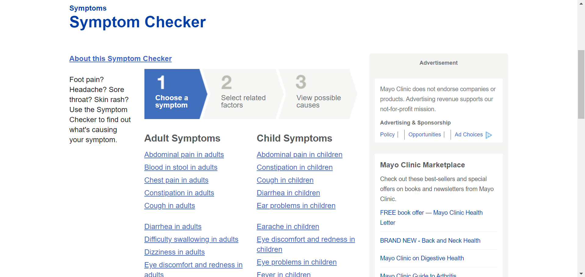

# Appropriately Delivering Health Information to Seniors

## Assignment 1: Heuristic Evaluation

Emily Dong | DH110 | Spring 2021

According to the United Nations, the number of seniors (65+) is expected to double to 1.5 billion by 2050 globally. Despite seniors being one of the fastest-growing and wealthiest demographics in wealthy countries, many digital products fail to meet senior accessibility needs and have made them feel excluded from an online world that is unfriendly to those with bad eyesight, declined dexterity, and unfamiliarity with the web. For this project, I hope to demonstrate how accurate, online health information can cater to the needs of seniors so that they can maintain their well-being. By designing for their accessibility, we can also make it easier for non-seniors to access health information as well.

### Severity Ratings for Usability Problems by [Nielson Norman Group](https://www.nngroup.com/articles/how-to-rate-the-severity-of-usability-problems/)

The following rating scale can be used to evaluate the severity of usability issues:
| Rating | Description |
|---|---|
| 1 | Cosmetic problem only: need not be fixed unless extra time is available on project |
| 2 | Minor usability problem: fixing this should be given low priority |
| 3 | Major usability problem: important to fix, so should be given high priority |

## Website 1: [Mayo Clinic](https://www.mayoclinic.org/)

### About the Project
Mayo Clinic is a non-profit American medical organization dedicated to clinical practice, education, and research, and whose location in Minnesota has been recognized as the best hospital of 2020-2021 by U.S. News & World Report. Mayo Clinic is a trusted source of medical information about diseases and conditions, possible causes for symptoms, drugs and supplements, tests and procedures, and healthy living.

The richness of health information on the Mayo Clinic website can be both valuable and overwhelming. My goal is to ...

### Heurisitic Evaluation

#### 1. Visibility of System Status
* As you type in the search bar, results are not immediately displayed, which makes it difficult for the user to understand how the system is responding to their query.

*Recommendation: Display results as the user types so that the user stays engaged, making it more likely they will continue to explore the site to find the information they need.*

#### 2. Match Between System and the Real World

*Recommendation:* 

#### 3. User Control and Freedom

*Recommendation:*

#### 4. Consistency and Standards
* When you click Request Appointment, you cannot go back to the homepage by clicking the logo on the top-left corner, which is what every user expects.

#### 5. Error Prevention
* Mayo Clinic is currently not accepting online requests for COVID-19 vaccine appointments. Although they provide a warning message above the button to request an appointment, users can easily skip this message. In the following pop-up dialogue box, users would likely randomly click "Yes" or "No" without regard to what the message is.

*Recommendation: Place warning message in the pop-up dialogue box. Provide visual weight to "No" to show that that is the preferred response, or get rid of the dialogue box and make users check a box to confirm that they are NOT requesting a COVID-19 vaccine appointment before they click "Begin an online request".*

#### 6. Recognition Rather Than Recall

*Recommendation: Include a sample search query in the input field so that users know what they can look for.*

#### 7. Flexibility and Efficiency of Use

* Because the magnifying glass is within the search box, the user may not recognize that there is another way to trigger the search action (other than Enter).
*Recommendation: Create a separate button for searching that includes the magnifying glass so that the user easily recognizes that it can be clicked.

* The search bar allows the user to either use the Enter key to search or click the magnifying glass. However, because the magnifying glass is within the search box, users may not recognize that. 

* The user needs to select from a large list of symptoms, which is cumbersome and overwhelming.

*Recommendation: Implement a search feature so that users can efficiently find the symptom they are experiencing.*

#### 8. Aesthetic and Minimalist Design

#### 9. Help Users Recognize, Diagnose, and Recover From Errors

#### 10. Help and Documentation

### Severity Rating
| Rating | Description |
|---|---|
| 1 |  |
| 2 |  |
| 3 |  |
