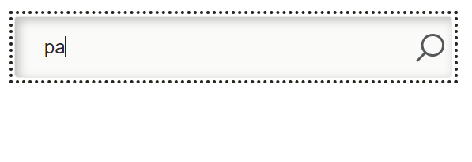
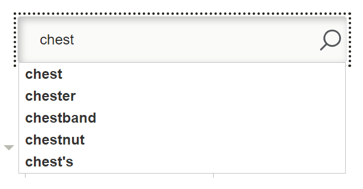
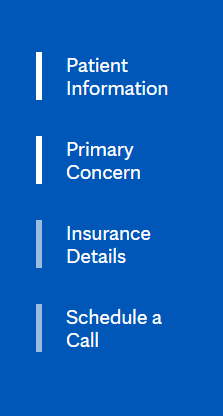
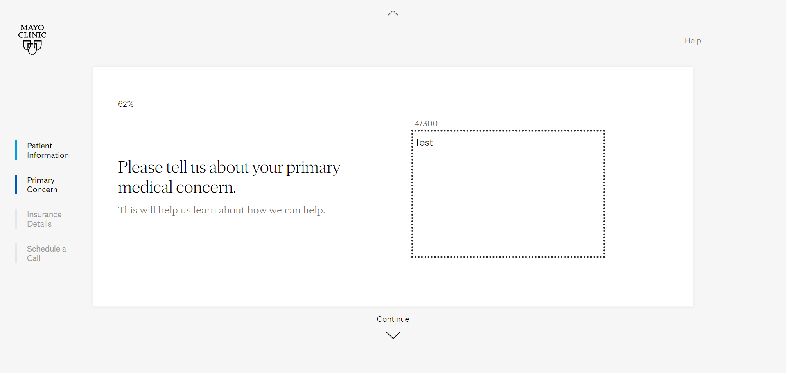
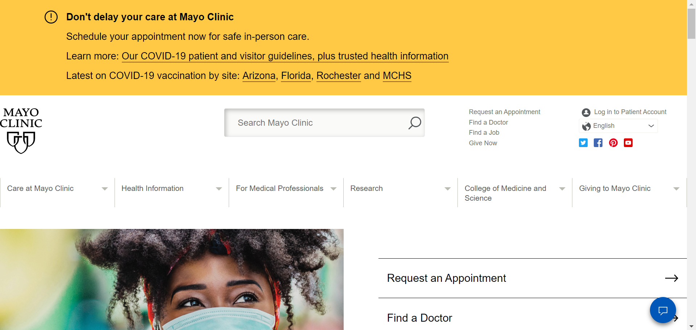
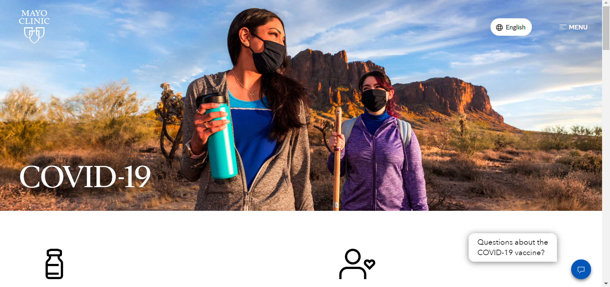
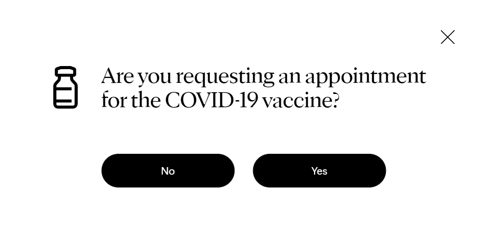
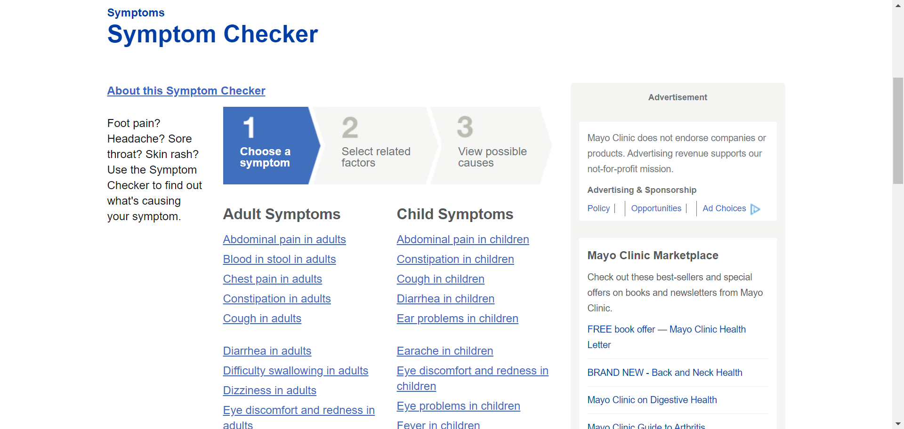
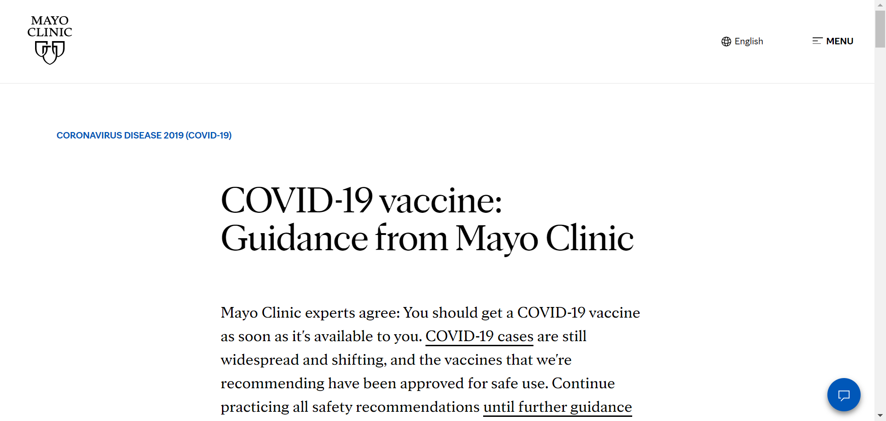

# Appropriately Delivering Health Information to Seniors

## Assignment 1: Heuristic Evaluation

Emily Dong | DH110 | Spring 2021

According to the United Nations, the number of seniors (65+) is expected to double to 1.5 billion by 2050 globally. Despite seniors being one of the fastest-growing and wealthiest demographics in wealthy countries, many digital products fail to meet senior accessibility needs and have made them feel excluded from an online world that is unfriendly to those with bad eyesight, declined dexterity, and unfamiliarity with the web. For this project, I hope to demonstrate how accurate, online health information can cater to the needs of seniors so that they can maintain their well-being. By designing for their accessibility, we can also make it easier for non-seniors to access health information as well.

### Severity Ratings for Usability Problems by [Nielson Norman Group](https://www.nngroup.com/articles/how-to-rate-the-severity-of-usability-problems/)

The following rating scale can be used to evaluate the severity of usability issues:
| Rating | Description |
|---|---|
| 1 | Cosmetic problem only: need not be fixed unless extra time is available on project |
| 2 | Minor usability problem: fixing this should be given low priority |
| 3 | Major usability problem: important to fix, so should be given high priority |

## Website 1: [Mayo Clinic](https://www.mayoclinic.org/)

### About the Project
Mayo Clinic is a non-profit American medical organization dedicated to clinical practice, education, and research, and whose location in Minnesota has been recognized as the best hospital of 2020-2021 by U.S. News & World Report. Mayo Clinic is a trusted source of medical information about diseases and conditions, possible causes for symptoms, drugs and supplements, tests and procedures, and healthy living.

The richness of health information and breadth of features on the Mayo Clinic website can be both valuable and overwhelming. My goal is to preserve the value while streamlining the user's ability to navigate throughout the website.

### Heurisitic Evaluation

#### 1. Visibility of System Status
* As you type in the search bar, possible options are not immediately displayed, which makes it difficult for the user to understand how the system is responding to their query (results start displaying only after 3 letters are inputted, but users expect it to be instantaneous). Furthermore, the recommended results shown are sometimes almost completely unrelated to health or medical information, which doesn't help the user.

  
  

> *Recommendation: Display results as the user types so that the user stays engaged, making it more likely they will continue to explore the site to find the information they need. Optimize search results so that they are relevant to health and medical information.*

* Within each major step in the appointment-making process, there is a bunch of other steps. Because there is little visual representation of progress, users could be thwarted by the number of times they have to click "Continue". There is an outline on the left that changes color for the *major* steps completed, but at the beginning of each major step, the whole screen turns blue, making the contrast too low to see their progress:

  

There is also a percentage completed shown at the top left as the total progress indicator, but it is so small that users probably wouldn't notice it at first glance.

> *Recommendation: Don't make the whole page blue at each major step. Keep the page gray/white to ensure contrast in the progress tracker. Also, create a visual representation of progress by numbering the steps and including arrows. Implement a progress bar that slides forward as the user completes the information.*

#### 2. Match Between System and the Real World
* 

*Recommendation:* 

#### 3. User Control and Freedom
* 

> *Recommendation:*

#### 4. Consistency and Standards
* Their page for COVID-19 and vaccine information is completely different from their normal website, which could confuse users because it seems like a separate website. Also, the navigation is hidden in a hamburger menu on the top-right, which is both less discoverable and unconventional.

  
  

> *Recommendation: Show navigation at the top rather than hiding it in the hamburger menu. 

* When you click Request Appointment, you cannot go back to the homepage by clicking the logo on the top-left corner, which can be frustrating for many users who expect that they can orient to the homepage by clicking the logo. The logo at the top left corner is probably the most common design pattern and needs to be upheld throughout the website

> *Recommendation: Make sure every functionality is consistent throughout the website so that users don't get 'lost' on a certain page.*

#### 5. Error Prevention
* Mayo Clinic is currently not accepting online requests for COVID-19 vaccine appointments. Although they provide a warning message above the button to request an appointment, users can easily skip this message. In the following modal window, users would likely randomly click "Yes" or "No" without regard to what the message is because they are habituated to getting out of the dialog window as fast as possible.

> *Recommendation: Get rid of the modal window and provide radio buttons to get users to make a deliberate choice between "Yes" and "No". It would also be helpful to display the error message again if the user clicks "Yes", rather than force them onto a page that doesn't explain the error they made.*

#### 6. Recognition Rather Than Recall

> *Recommendation: Include a sample search query in the input field so that users know what they can look for.*

#### 7. Flexibility and Efficiency of Use
* Because the magnifying glass is within the search box, the user may not recognize that there is another way to trigger the search action (other than Enter).

> *Recommendation: Create a separate button for searching that includes the magnifying glass so that the user easily recognizes that it can be clicked.*

* The user needs to select from a large list of symptoms, which is cumbersome and overwhelming.

> *Recommendation: Keep the list so that users can just recognize and click on recommendations, but implement a search feature at the top so that users can have the option to efficiently find the symptom they are experiencing. Also, group the symptoms into different categories to help users find the symptom they are looking for more easily.*

* Under Billing, clicking the name of a category doesn't display the drop-down menu, but rather takes you to another page with the same categories, just displayed in a different format, which can be disorienting. The user must click the + sign to get the drop-down menu, which requires dexterity and is therefore less accessible for seniors.

> *Recommendation: Make it possible to access the drop-down by clicking the name of the category.

#### 8. Aesthetic and Minimalist Design
* The billing and payments page has a very cluttered design

#### 9. Help Users Recognize, Diagnose, and Recover From Errors
* If the user clicks "Yes" in the modal window asking if they are requesting a COVID-19 vaccine, they are directed to another page that doesn't immediately explain why they weren't directed to the appointment-making process. Instead, the page they land on is essentially an About page for COVID-19 vaccines.

> *Recommendation: Immediately explain why they can't make an appointment for COVID-19 vaccines at the time.*

#### 10. Help and Documentation

### Severity Rating
| Rating | Description |
|---|---|
| 1 |  |
| 2 |  |
| 3 | Flexibility and Efficiency of Use |

**Website 2: 

