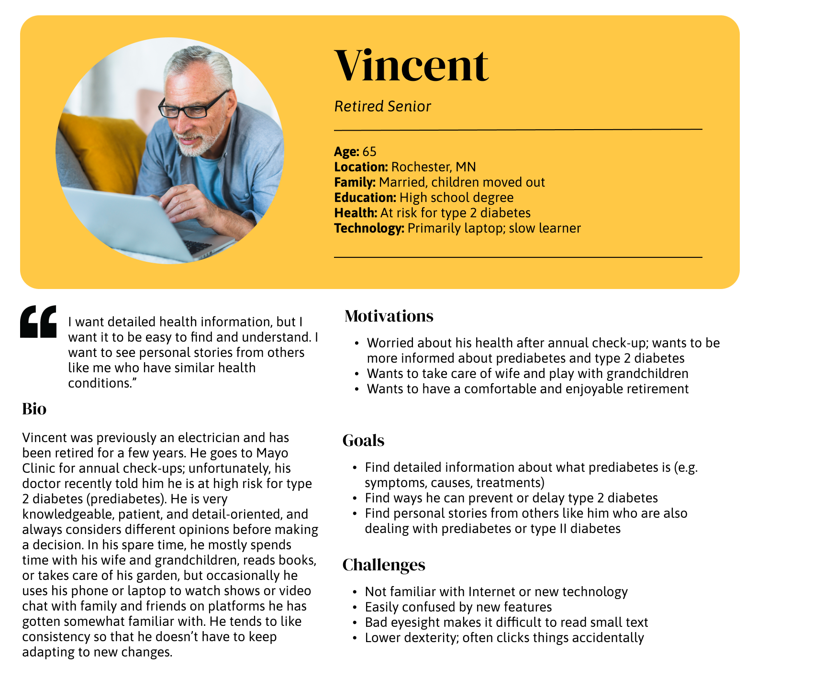
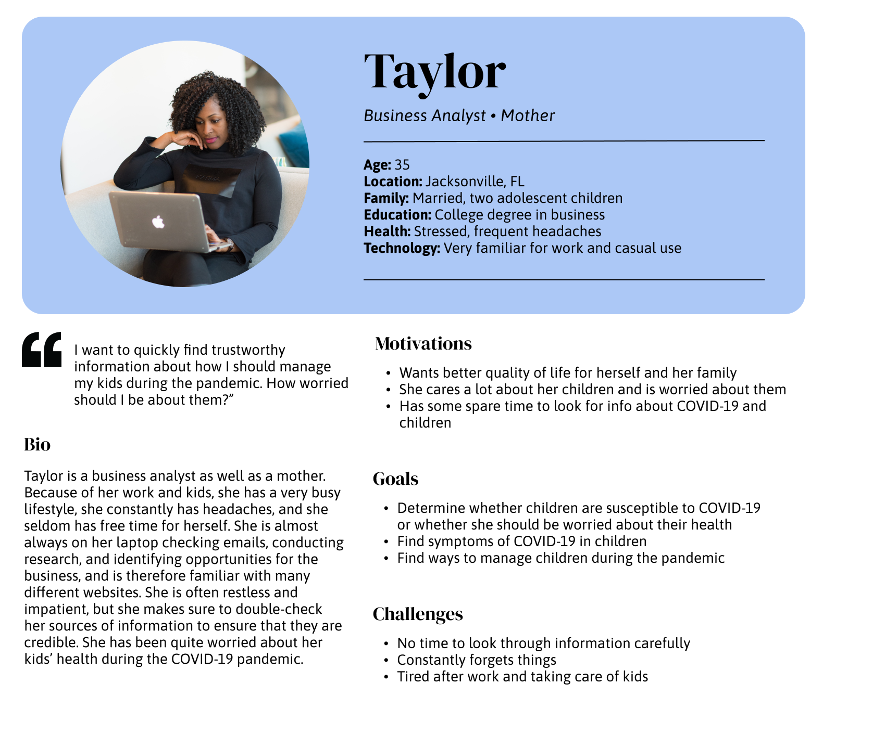
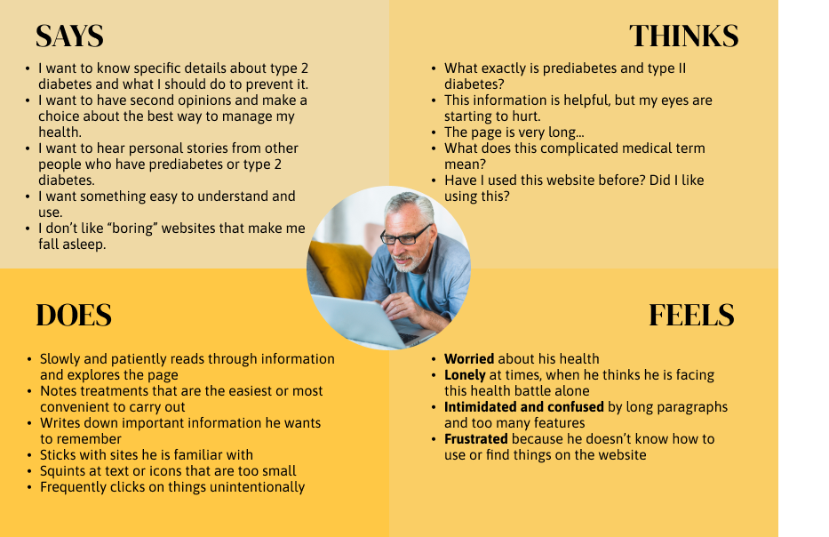
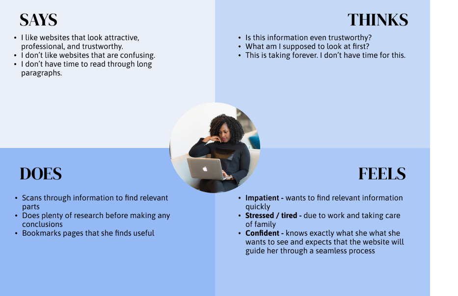
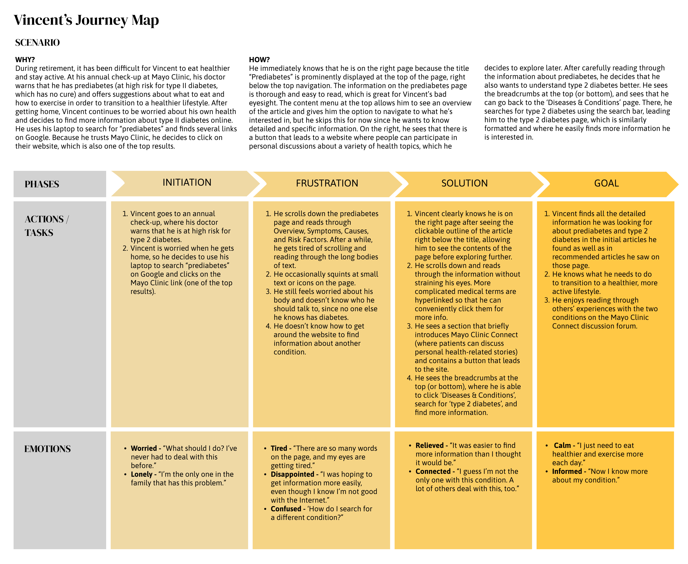
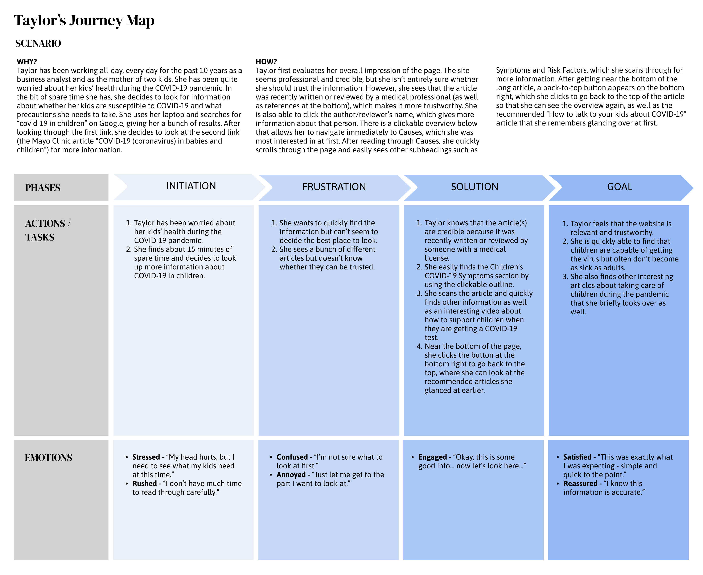

# Assignment 4: UX Storytelling

## Purpose of UX Storytelling
Storytelling is needed for building empathy. It gives us the ability to create a shared understanding of why we are building a feature, and it serves as an important medium for communicating difficult concepts in a logical way. It also focuses us on the perspective of the user, allowing us to understand the reasons behind a user’s actions and reminding us that *we are not the user*. Storytelling can even facilitate the generation of new ideas and can be used to convince key stakeholders to make decisions that will benefit the user in addition to the business.  

## Proposed Design Features

Based on previous research and analysis of the Mayo Clinic website, I identified some features to re-design:

1. Clickable outline of article at the top
2. Consistent breadcrumbs at the top and bottom of each page
3. Consistent search feature on health information subcategories (e.g. Diseases & Conditions, Symptoms, Tests & Procedures, Drugs & Supplements)
4. Visible author/reviewer's name and date below article's title; clickable and leads to info about the author/reviewer
5. Section that briefly introduces Mayo Clinic Connect (site where patients can discuss personal health-related stories) with button that leads to the site

In addition, I want to implement:
* More condensed top navigation menu and global notification banner to better utilize space 'above the fold'
* Clear and consistent format/hierarchy across health information pages
* Increased contrast of text and larger font size (approx. 16px)

## User Personas

  
  

## Empathy Maps

  
  

## User Scenarios and Journey Maps

  
  

