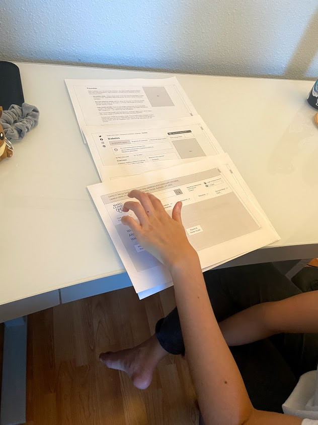
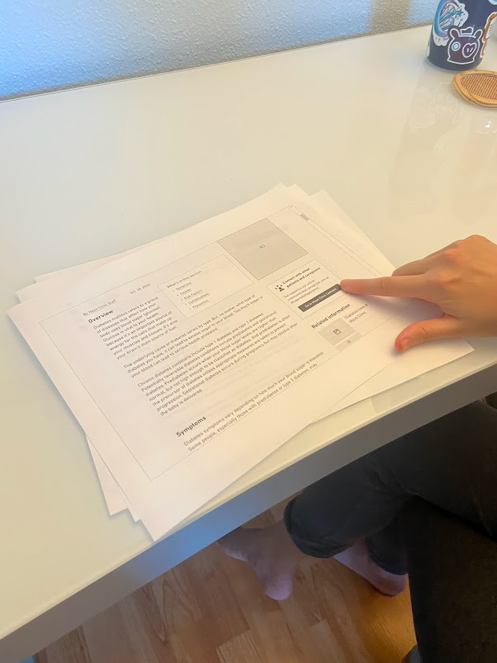
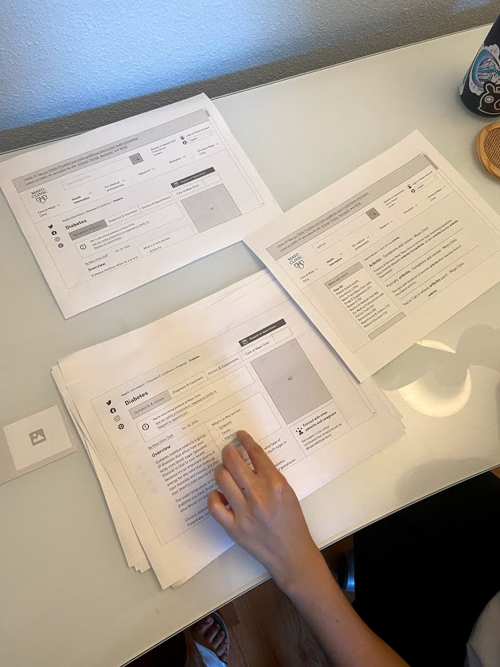

# Assignment 5: Low-fidelity Prototype

## Project Description

My project is to redesign the Mayo Clinic website to make it more consistent and intuitive to use. Currently, the website has too many duplicate links, competing features, and irregular hierarchies, which can lead to confusion and choice paralysis in users. In an attempt to satisfy the requirements of two [personas](https://github.com/emilydong001/DH110/blob/main/Assignments/Assignment04.md), I wanted to incorporate a few new features:

1. **Clickable outline/overview:** Allows the user to quickly navigate to different parts of the article
2. **Breadcrumbs:** Displayed consistently at the top of each article; can be used as alternative navigation and gives the user a sense of where they are on the site
3. **Search feature on each health information subcategory (e.g. Diseases & Conditions, Symptoms, Tests & Procedures, Drugs & Supplements):** Allows the user to search by typing rather than only search by first letter
4. **Section that leads to Mayo Clinic Connect:** Briefly introduces the user to Mayo Clinic Connect and allows them to directly go on that site to discuss personal health-related stories with other patients and/or caregivers (as I understand, the main Mayo Clinic site currently does not have a link to Mayo Clinic Connect).

I also wanted to simplify the website to only the necessary componenets and reorganize the website so that the abundance of health information is clearer and easier to access, especially for older, less tech-savvy users.

## Purpose of Low-Fidelity Prototyping

In order to test if the features I proposed would actually be beneficial to a real-life user, I created a low-fidelity paper prototype. The purpose of doing this is to quickly and cheaply test the functionality of the website, validate design decisions, and gain new insights from users. By doing so, we avoid wasting time and resources down the road.

## Methods

First, I used [Whimsical](https://www.whimsical.com/) to wireframe an updated Mayo Clinic website based on the features listed above, and then I printed out each screen on printer paper. I also created a wireflow to show the expected pathways a user could take (see below) and had a user go through a few tasks to see if their real-life actions match what I would expect.

### Tasks Supported by the Prototype
1. Quickly finding information about diabetes (after landing on the diabetes page from Google)
2. Using either the main navigation or Diseases & Conditions page to search for information about arthritis
3. Going to the Mayo Clinic Connect page, where they can discuss health with other patients and/or caregivers

### Interactions Supported by the Prototype
* Using the clickable outline to navigate to a certain section of the article (e.g. Prevention)
* Using the secondary navigation to find more information about the diseases or condition (e.g. Diagnosis & Treatment)
* Clicking a button to go to the Mayo Clinic Connect page
* Scrolling to the top of a long page using the back-to-top button (appears after the user has scrolled 3/4 the article)
* Using the 'Health Information' tab on the main navigation (or the breadcrumbs) to get to Diseases & Conditions page
* Using the search bar within Diseases & Conditions (or the main navigation search bar) to search for another disease or condition
* Clicking the logo to get back to homepage

Other changes I made to the original site include:
* More condensed top navigation menu and global notification banner to better utilize space 'above the fold'
* Clear and consistent format/hierarchy across health information pages
* Increased contrast of text and larger font size

## Wireframes and Wireflow

  

Please see wireframes and wireflow in full resolution [here](https://whimsical.com/dh110-a05-JnD8JzRCQJ5eQxTb4QqMdB).

## Testing

### User testing

  
  
  

## Insights

:bulb: **The ads on the right make many features below them less visible. The user ignored the right side of the page for the most part and therefore had a hard time finding the Mayo Clinic Connect section.**
* Features on the right need to have more visual contrast that separates the ad from the content of the page; perhaps a color border.
* Consider moving the Mayo Clinic Connect section somewhere more visible.

:bulb: **The user ignored the back-to-top button and opted to simply scroll instead. The user mentioned that they are used to scrolling and tend to ignore back-to-top buttons, even though they are noticeable.**
* Include bottom navigation visually similar to the top navigation, which could eliminate the need for a back-to-top button.
* Another user mentioned that they would only use back-to-top buttons for extremely long pages.
* *Insights may be different for populations that are less used to scrolling or find it difficult to scroll through long pages.*

:bulb: **The user did not utilize the 'Health Information' tab in the main navigation at all. They would rather just search.**
* The user would rather search than use any other functionality, so the search function needs to be the most prominent and functional.
* 'Health information' as a label is too vague (everything on the website is technically health information).

:bulb: **The user finds the clickable outline helpful to navigate quickly throughout the article.**
* The user mentioned that they would normally just scroll and quickly scan the headlines of the article. However, they would find the clickable outline helpful when they scan too fast throughout the page and can't find what they are looking for.
* The clickable outline has good placement and doesn't need to be changed.
