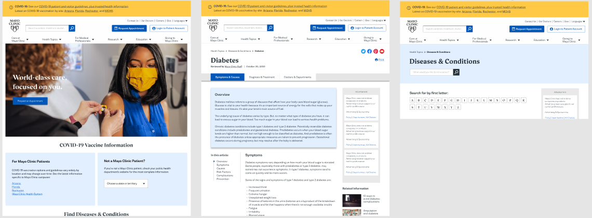
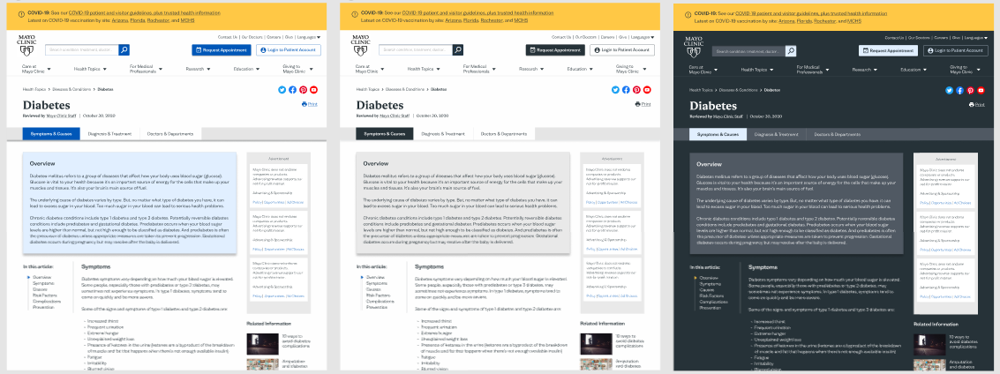
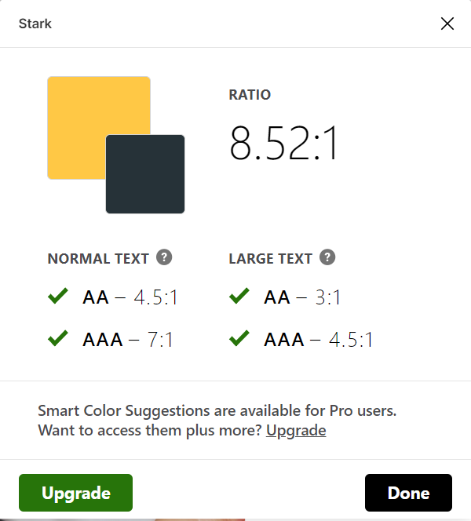
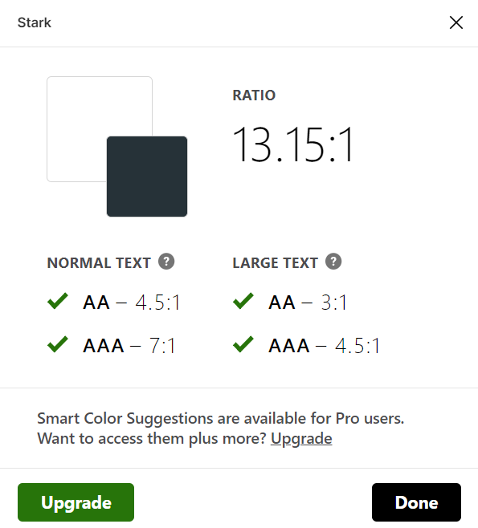
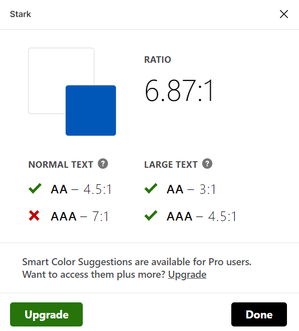
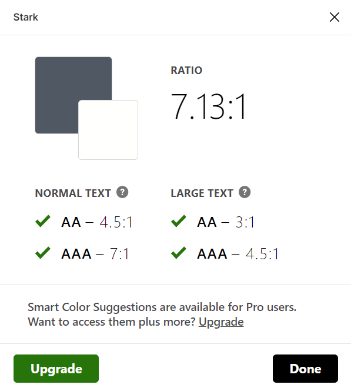

# Assignment 06: Interface Design

## Project Overview

The goal of this project is to increase accessibility to health information from the widely-trusted [Mayo Clinic website](https://www.mayoclinic.org/). After testing my low-fidelity paper prototype, I created a high-fidelity prototype taking into account feedback from the user. The main purpose is to conduct another usability test with the high-fidelity prototype and have target users validate the design before it is officially sent to a developer. The final high-fidelity prototype will allow the user to:
* Quickly find information about diabetes (after landing on the diabetes page from Google)
* Use either the top navigation or Diseases & Conditions page to search for information about arthritis
* Be directed to the Mayo Clinic Connect page, where they can discuss health with other patients and/or caregivers

## Screen Designs

### Screen Templates
These are screenshots of three representative screen templates as well as three color modes for one of the templates:

  
  

Please see prototype [here](https://www.figma.com/file/UIjfi4ADU1IkrE7mkrhKkn/DH110-Assignment06?node-id=0%3A1).

### Color Scheme
For the color scheme, I utilized Mayo Clinic's new [branding guidelines](https://end-dev-zone.mayo.edu/), which has only been implemented in some of the newest pages on the website (e.g. the [COVID-19](https://www.mayoclinic.org/coronavirus-covid-19) page). I also made sure that the colors I used were simple, since this is health website and we want to maintain their professionalism. 

### Accessibility Check

Using the [Stark](https://www.getstark.co/) plugin, I checked the accessibility for major areas of interaction and for all three color modes:

  
  
  
  

They all met the WCAG2.0 AAA level standard of accessibility except for the royal blue (taken from Mayo Clinic branding guidelines) and 'white' combination, which still met the AA level. I therefore concluded that these color schemes were accessible.

## Impression Test

Here are some direct quotes from three people who conducted a first impression test with the normal light mode:

* "I see a webpage with a nice color scheme (blue/gold) for Mayo Clinic"
* "I think that I could learn a lot about diabetes from this webpage and find different resources like doctors and diagnoses."
* "I really like the table of contents!"
* "it seems like a page detailing info about diabetes"

Based on these comments, I was able to accomplish the general idea that this is a **detailed** and **trusted** source of health information.

Video of a recorded impression test will be uploaded later.

## Design System

### Typeface
Unfortunately, I could not access the exact typeface from the Mayo Clinic branding guidelines (only the homepage could be viewed). I chose two fonts that were the most similar based on an online [font identification tool](https://www.myfonts.com/WhatTheFont/), the Ariata font family and the Bw Nista font family.
* **Ariata:** Use for larger headlines or visual contrast, 48 pt for titles, 36 pt for subtitles
* **Bw Nista:** Use for smaller copy, 16 pt for small copy (e.g. breadcrumbs), 18 pt for body copy, 24 pt + bold for headings and 20 pt + bold for subheadings

### Color Scheme

**Light-mode:** 
* Background: #FEFEFE
* Primary (default text): #263238
* Focus: #0057B8
* Secondary Focus: #E1EFFF

**Dark-mode:** 
* Background: #263238
* Primary (default text): #FEFEFE
* Focus: #E1EFFF
* Secondary Focus: #505963

### Layout Grid and Spacing
* **Layout grid**: I didn't use a specific grid for every page, but I kept the margins at 72px to allow for "breathing room" on each side. I had one column for text in the middle, which helps guide the reader down the page. I also two columns on the left and right - the left is thinner and would be reserved for the clickable outline for the majority of the page, and the right is wider for advertisements, related information, etc.
* **Line-spacing between body text**: 150% for readibility and legibility

In general, I wanted to keep it simple. I plan to add a footers for the final high-fidelity prototype, which would have a different layout.
