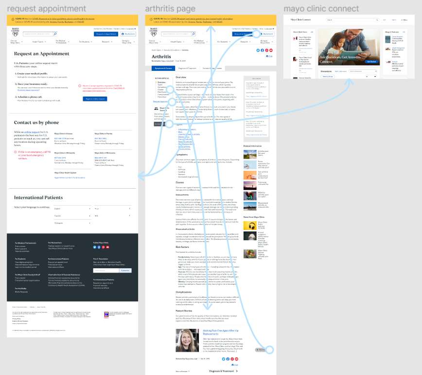
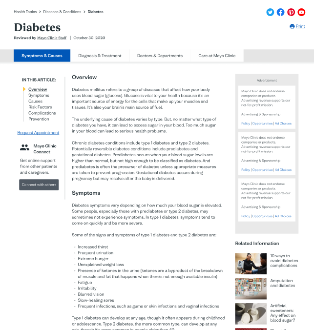

# Assignment07: High-Fidelity Prototype

## Tasks Supported
1. Using the clickable outline to navigate directly to topic of interest
2. Back-to-top button only at the end of very long pages
3. Clicking on button (under clickable outline) to navigate to Mayo Clinic Connect
5. Searching for information about 'arthritis' or 'diabetes' on main navigation or Diseases & Conditions page
6. Hovering over 'Health Topics' to reveal a large menu with subcategories, and navigating to Diseases & Conditions page from there
7. Using breadcrumbs to navigate to Diseases & Conditions page
8. Clicking 'Request an Appointment' button across multiple pages
9. Navigating back to homepage using logo

Ideally, I would have made the clickable outline sticky so that it follows the user as they scroll down the page, which may eliminate the need for the back-to-top button. However, Figma does not currently support sticky elements past the fold line.

## Interactive Prototype
Link to interactive prototype [here](https://www.figma.com/proto/UIjfi4ADU1IkrE7mkrhKkn/DH110-Assignment06?node-id=131%3A569&scaling=scale-down-width&page-id=0%3A1).

## Wireflow
Here's a snapshot of the full wireflow:

  

I also made 'zoomed-in' versions to more clearly depict certain parts of the flow. Some interactions are missing to make the snapshot more clear; for example, all the logos in the prototype navigate back to the homepage, but that is not shown in these 'zoomed-in' versions. 

This one shows the search flow from the homepage to either the diseases & conditions page or directly to the search results for 'arthritis', and then from the search results to the health information page for arthritis.

  

This one shows navigation through the arthritis page using the clickable outline and the back-to-top button, as well as navigation to the Mayo Clinic Connect page and the Request Appointment page.

  

## Cognitive Walkthrough
In terms of first impressions, students mentioned that the design looked professional, clear, and that they liked the font and color choices. During the in-class cognitive walkthrough, I went through the task of finding health information about arthritis and diseases, first using the diseases & conditions page and next through the search bar. They didn't seem to have trouble following the flow. I then went through the task of navigating through the pages for diabetes and arthritis using the clickable outline and back-to-top button, and they mentioned that it was convenient to use rather than having to scroll through the whole page. Overall, they described the website as very intuitive to use.

## Iterations
One user commented that the original placement of the clickable outline was difficult to see, though this may be due to the limited interactions that could be prototyped (e.g. the outline is not sticky). Still, in response to this, I removed the overview box and moved the outline up so that it is visible right under the secondary navigation bar. I also removed the box around the outline to make the interface less cluttered.

  
  

One user commented that they thought it felt like a business website - serious and professional. I did want the website to have that impression, but I also wanted the site to look more welcoming. Ideally, I would switch the landing page photo to one that captures a happier experience for the patient, but free stock photos on Unsplashs, Pexel, and other similar websites are limited in their selection of choices. I also made sure to round off the corners of all the buttons to emphasize the more friendly atmosphere. They also commented that it was difficult to see the language toggle at first, which is especially important for accessibility. In response to this, I moved the language option more towards the left so that the user can see it more readily in the top navigation:

  
  

## Reflection

The goal of this project is to increase accessibility to health information from the widely-trusted [Mayo Clinic website](https://www.mayoclinic.org/). The most difficult part of building this prototype was deciding where different elements should go and how we can maintain the huge amount of information on the website while also sticking to the brand guidelines, preserving the working parts of the website, and introducing more clarity for users. The personas I created helped create a more focused direction on how I should redesign the website - mainly, I wanted to make the site less cluttered, remove repetitive links that would likely be ignored by users, increase accessibility for seniors, allow faster navigation through long pages, and simply make the site more consistent overall. Usability testing and impression tests with low- and high-fidelity prototypes definitely helped with this process, since I was able to determine which features were the most confusing to users. 

Some things that can improve in the future:
* For the health information pages that are very long (like the diabetes page), there could be an opportunity to give a break to users by using dividers - either a simple line or even a section that introduces the Mayo Clinic marketplace..
* Perhaps create a version with a 16px base font size to give users an option of whether they want larger or smaller font size. 
* If possible, allow the user to hover over difficult medical terms so that they can learn more about the term without having to visit another site.
